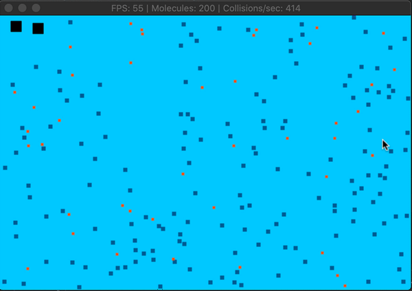

# CPPND: Capstone project of Peter Trebing

This is the Udacity C++ Nanodegree Capstone project of Peter Trebing.

This project is a greatly simplified simulation of the atmosphere and the greenhouse effect. It implements a particle system which represents three athmospheric gas molecules: 

- N2, nitrogen (grey particles)
- O2, oxygen  (red particles)
- CO2, carbon dioxide (the black, bold very bad particles :)

Note: The proportions are not to scale. 

The collisions of the molecules are simulated according to the rules of Newtonian physics. The model shows how the molecules collide and exchange kinetic energy. Also the model simulates, 
a constant loss of energy i.e. the molecules gradually lose speed until they finally come to a standstill after a long time. 
Over time the atmosphere 'freezes' so to speak.

The title of the simulation window shows 

- the frames per second (FPS)
- the current number of molecules (default: 200)
- the number of actually detected collisions per second



Note: 
The number of tests increases with the square of the number of molecules. 
For example: for 200 molecules 200^2 - 1 = 39.999 collision test are necessary.
In the title only the detected collsions are shown.

## User interaction
The simulation allows the following user inputs:

| Shortcut        | Action                                  | 
| :-------------: |:---------------------------------------:| 
| H               | Heat up - accelerate the CO2 molecules  |
| C               | Cool down - slow down the CO2 molecules |
| +               | Add more N2 and O2 molecules            |
| -               | Remove N2 and O2 molecuules             |
| CTRL-Q          | Exits the simulation                    |

### Heat up the atmosphere
To heat up the atmosphere, you can accelerate the CO2 molecules by a factor 2
by pressing the 'H' key. This simulates the irradiation of solar energy. 
The CO2 molecules then collide randomly with N2 and O2 molecules and transfer 
part of their kinetic energy so that the total energy and thus the temperature of the 
gas (atmosphere) rises. Because of the simulated friction between gas molecules, the energy of the whole system declines again. Over time the molecules become slower again. The N2 and O2 molecules are not directly affected by this key.

### Cool down the atmosphere
This reduces kinetic energy from the CO2 molecules. It slows down the velocity of the CO2 molecules by a factor or 0.5 at every key press. Because friction/damping is also simulated the atmosphere will cool down over time. The N2 and O2 molecules are not directly affected by this key.

### Add more molecules
You can increase the density of the atmosphere by pressing '+'. This adds new N2 and O2 molecules. Be careful with this, because it increases the computing effort, slows down the simulation and reduces the frame rate.

### Remove molecules
Decrease the atmospheric density by pressing '-'. This will remove 2 molecules by chance, but not CO2.

### Stop the simulation
If it gets too hot for you :), you can terminate the simulation by pressing CTRL-Q.

## Standard configuration
All standard settings of the simulation are located in a file named 'simulation_config.txt'. This file is read by class configuration.h, which reads the file and contains getters (and setters) for all configuration parameter.
You do not necessarily need to change the configuration. It is designed to run the simulation smoothly on the Udacity cloud infrastructure. Here is an excerpt: 
```
 # Configuration file for the particle collision simulation
 
 # Windows size
 window_width=600
 window_height=400
 
 # Target frames per second (may not be reached)
 fps=60
 
 #Particles
 particle_count=200
 
 ...and  many more...
```


## Dependencies for Running Locally
* cmake >= 3.7
  * All OSes: [click here for installation instructions](https://cmake.org/install/)
* make >= 4.1 (Linux, Mac), 3.81 (Windows)
  * Linux: make is installed by default on most Linux distros
  * Mac: [install Xcode command line tools to get make](https://developer.apple.com/xcode/features/)
  * Windows: [Click here for installation instructions](http://gnuwin32.sourceforge.net/packages/make.htm)
* SDL2 >= 2.0
  * All installation instructions can be found [here](https://wiki.libsdl.org/Installation)
  * Note that for Linux, an `apt` or `apt-get` installation is preferred to building from source.
* gcc/g++ >= 5.4
  * Linux: gcc / g++ is installed by default on most Linux distros
  * Mac: same deal as make - [install Xcode command line tools](https://developer.apple.com/xcode/features/)
  * Windows: recommend using [MinGW](http://www.mingw.org/)

## Build Instructions
1. git clone https://github.com/vpursuit/CppND-Capstone.git
2. Compile: `cmake . && make`
3. Run it: `./CollisionSim`.

Note:
Be sure you run CollisionSim in the same directory as the file simulation_config.txt

## Implementation
In order to distribute the computing load among the hardware, the simulation utilizes 3 independent Threads:

### Main Thread
The main thread which controls user input, performs rendering using SDL2 and tries to achieve a target number of frames per second by measuring time.
The implementation of this can be found in simulation::Run / ~line 59. The while loop runs as long as the 'running' attribute is true. 
If the running attribute is set to false (indirectly by class controller and the user interaction), the simulation object gets destructed. 
Its destructor Simulation::~Simulation at first informs all other threads to terminate gracefully and then joins all of them.
Eventually all threads stopped and the destruction is complete.

```
  while (running) {

        // sleep at every iteration to reduce CPU usage
        std::this_thread::sleep_for(std::chrono::milliseconds(1));

        // compute time difference to stop watch
        long timeSinceLastUpdate = std::chrono::duration_cast<std::chrono::milliseconds>(
                std::chrono::system_clock::now() - lastUpdate).count();

        // Its time to render a frame to met the fps spec.
        if (timeSinceLastUpdate >= target_frame_duration) {

            // Input, render - the main game loop.
            ... // skipped
            // Compute physics in extra thread and only render here
            renderer.render(_simulatedObjects);

            frame_count++;

            // After every second, update the window title.
            ... //skipped

            // reset stop watch for next cycle
            lastUpdate = std::chrono::system_clock::now();

        }

    }
```
You see above: there is no physics and collsion computation inside the main thread, only user interaction and rendering.

### Integration thread
The task of this thread is to calculate the position of all molecules in the next simulation step using Newtonian physics in a 2-dimensional space.
The thread is started in simulation::Run:

```
...
    // Start a physics thread
    _threads.push_back(std::make_unique<std::thread>(std::thread([&]() { physics2D.run(); })));
...
```
The physics itself is implemented in class particlePhysics2D::run. While the main thread tries to reach a target FPS of 60, the physics thread runs as fast as possible, 
only sleeping for 1 millisecond after every simulation step to prevent from too high CPU load.

### Collision thread
The task of the collision thread is to determine the collision of molecules and to treat them them according to the Newtonian mechanics.
[See: Momentum at Wikipedia](https://en.wikipedia.org/wiki/Momentum#Conservation)

Again this thread is started in Simulation::Run() and added to the vector of running threads.

```
...
    _threads.push_back(std::make_unique<std::thread>(std::thread([&]() { physics2D.collider(); })));
...
```

Like the integration thread, this thread runs as fast as possible, only preventing CPU from burning by sleeping for 1 millisecond after a set of collisions has been found and resolved. Find the implementation in particlePhysics2D::collider.

### Thread synchronization
All three threads need access to the list of molecules without creating race conditions or deadlocks. 
Therefore I created a template class 'synchronizedList' which utilizes a mutex (a recursive one) and lock guards in every accessor method to synchronize access to the private vector of shared pointers to the objects to be simulated.
This template class is used to define the type SimulationObjects, see: simulationObject.h
``` 
typedef SynchronizedList<SimulationObject> SimulationObjects;

```
Note:
I implemented my own control structure to apply functions to all items inside the synchronized list. The functions are designed as Lambda Functions:
``` 
SynchronizedList::void map(const std::function<bool(std::shared_ptr<T> &part, size_t)> &f)

```
Of course the map function works under a lock_guard. A simpler example how to use this can be found in particlePhysics2D::changeEnergy
``` 
void PatrticlePhysics2D::changeEnergy(double factor) {
    _simulatedObjects.map([factor](std::shared_ptr<SimulationObject> &obj, size_t i) -> bool {
        if (obj->getSensitivity() == Sensitivity::sensitive) {
            Particle &part = obj->getParticle();
            Vector3 velocity = part.getVelocity();
            part.setVelocity(velocity * factor);
        }
        return false;
    });
}
```

The implementation of map it rather simple and is based on the old for-loop:
``` 
void map(const std::function<bool(std::shared_ptr<T> &part, size_t)> &f) {
        // perform lambda operation under the lock
        std::lock_guard<std::recursive_mutex> uLock(_mutex);
        size_t i = 0;
        for (auto &part: _items) {
            if (f(part, i++)) break;
        }
    }
```

### SimulationObject and its derivatives
The strict abstract class SimulationObject ist an aggregation of a Particle (particle.h), which defines physical attributes and the visual outline of the object like color and size. Because it's virtual, it does not define an implementation for the methods delivering the visual outline.
#### Molecule
The class molecule (molecule.h) inherits this abstractions and add concrete implementation for color and size. The classes N2, O2 and CO2 (see: molecule.h), for their part,
inherit from class molecule, but define concrete values for the particle instance, the color and the size. 

In summary: I use aggregation, inheritance and abstract classes.

### Particles and Math
The physical particles are defined in class particle.h. A math toolbox, containing a vector implementation and basic linear algebra is located in mathtools.h.

Note:
the files particle.h/cpp and mathools.h/cpp contain derived work from the great github project
https://github.com/idmillington/cyclone-physics (MIT license).

### Memory management
The synchronized list makes use of shared pointers to make sure that the object behind the pointer is deleted after the last reference left its scope. The push_back method uses move semantics, so that the inserted smart pointer does not belong to any special thread, 
but is located solely inside the vector (shared references may exist outside):
``` 
    void pushBack(std::shared_ptr<T> &&v) {
        // perform vector modification under the lock
        std::lock_guard<std::recursive_mutex> uLock(_mutex);
        _items.emplace_back(std::move(v));
    }
```

The application of this method can be seen in Simulation::PlaceMolecule, where a new molecule is instantiated and then added to _simulatedObjects:

``` 
void Simulation::placeMolecule(Molecule *molecule, Vector3 velocity) {
  ... // skipped
            std::unique_ptr<SimulationObject> m(molecule); // create shared pointer to a new molecule
            Particle &part = m->getParticle(); // aquire reference to particle of that molecule
            part.setPosition(x, y, 0.0);
            part.setVelocity(velocity);
            part.setAcceleration(Vector3(Vector3::GRAVITY) * -config.getGravityFactor());
            part.setDamping(config.getDamping());
            // after all set and done add the new molecule to the list of simulated objects:
            _simulatedObjects.pushBack(std::move(m)); // using move semantics to outsource the smart_pointer from main thread
... // skipped
}
```

Have fun simulating the greenhouse effect :)